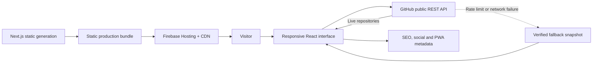

<div align="center">

# millersantosbr ID

### Real problems become useful products.

**A personal portfolio and living product manifesto by Miller Santos — built at the intersection of AI, web engineering, product thinking, and human-centered design.**

[](https://millersantosbr-id.web.app)
[](https://github.com/millersantosbr)
[](https://www.linkedin.com/in/miller-santos)

</div>


## The project

`millersantosbr ID` is more than a portfolio. It is a compact demonstration of how I think, design, and ship digital products.

The experience connects my professional background in technical support with my current work in product development. Support taught me to listen before acting, investigate symptoms without losing sight of the user, and understand that the best solution is not the most complex one — it is the one that reliably solves the real problem.

That perspective shapes every decision in this project: live public data instead of invented metrics, a clear narrative instead of a generic résumé page, purposeful motion instead of decoration, and a responsive system that remains expressive on a small screen.

> **My goal is not to use AI to produce more software. My goal is to use AI to understand faster, explore better, and build the right software with greater care.**

## My philosophy for building apps with AI

AI is a force multiplier, not a substitute for product judgment.

I believe strong AI-assisted development follows six principles:

1. **Start with the problem, not the prompt.** A well-written prompt cannot rescue an unclear product objective. I first identify the user, the friction, the context, and the outcome that matters.
2. **Give AI context before asking for output.** Product constraints, design language, technical boundaries, accessibility, and business intent should guide generation from the beginning.
3. **Use AI to expand the solution space.** I use it to compare approaches, expose blind spots, accelerate prototypes, and challenge assumptions — not simply to autocomplete code.
4. **Keep human ownership of every decision.** Architecture, trade-offs, security, experience quality, and the final definition of “done” remain my responsibility.
5. **Verify at the edges.** Generated code is tested against real content, small screens, failure states, rate limits, accessibility preferences, and deployment constraints.
6. **Ship learning loops.** A product is never finished because the first implementation compiled. I observe, refine, simplify, and turn feedback into the next iteration.

This approach lets me move quickly without confusing speed with quality. AI accelerates execution; product thinking protects direction.

## What this portfolio demonstrates

- A distinctive visual identity — **millersantosbr ID** — with a reusable palette, typography system, icon language, and editorial voice.
- A live integration with the public GitHub REST API that automatically presents my public repositories.
- A resilient fallback snapshot when GitHub is unavailable or a public rate limit is reached.
- A responsive 3D process scene that turns the journey from **real problem** to **useful product** into an interactive visual system.
- Mobile layouts designed intentionally for compact smartphones, not merely scaled down from desktop.
- Accessible navigation, visible focus states, semantic structure, reduced-motion support, and touch-friendly controls.
- PWA metadata, branded favicons, Apple touch assets, and a web app manifest.
- Static production delivery through Firebase Hosting, with fast global asset distribution and no server secrets.

## Technology decisions

| Technology | Why it is used here |
| --- | --- |
| **Next.js 16 / App Router** | Provides a clear component and metadata architecture, static generation, SEO-ready markup, font optimization, and a production path that does not require a permanent application server. |
| **React 19** | Makes the portfolio a composable product interface rather than a collection of disconnected pages. State is used only where it creates value: GitHub synchronization and mobile navigation. |
| **TypeScript 5** | Defines the GitHub data contract, protects component boundaries, and makes future changes safer. Strict typing is especially valuable when external API data can be incomplete. |
| **Custom CSS + Tailwind CSS 4 pipeline** | The visual identity depends on precise editorial layouts, perspective, 3D transforms, motion frames, responsive typography, and design tokens. Custom CSS keeps that language intentional while Tailwind's modern pipeline handles the stylesheet foundation. |
| **CSS 3D transforms and motion** | Communicate process and technical confidence without introducing a heavy graphics runtime. The experience remains lightweight and automatically respects `prefers-reduced-motion`. |
| **GitHub REST API** | Keeps the project catalog truthful and current. The integration uses public, unauthenticated endpoints, so no personal token is exposed to the browser. |
| **Firebase Hosting** | Serves the statically generated portfolio through a global CDN with HTTPS, predictable caching, and a simple repeatable deployment flow. |
| **Next Metadata API + Web App Manifest** | Provides canonical URLs, social previews, favicon variants, Apple touch support, and installable-app metadata from one typed configuration. |
| **Node test runner + ESLint** | Protect key content, integrations, responsive rules, metadata, and production assets without adding unnecessary test framework weight. |
| **Vinext / Vite compatibility build** | Retains a worker-compatible build path and keeps the project portable beyond a single hosting provider. |

## Product and data architecture



No database, private API, authentication secret, or privileged GitHub token is required for the public experience.

## Design system

The interface uses a restrained palette designed to feel technical without becoming cold:

| Token | Color | Role |
| --- | --- | --- |
| `Ink` | `#101512` | Primary text, contrast surfaces, structure |
| `Bone` | `#F2EEE6` | Main background and visual warmth |
| `Paper` | `#FBFAF6` | Reading surfaces and project cards |
| `Lime` | `#D9F24B` | Energy, live states, focus, system signals |
| `Clay` | `#9F4028` | Human warmth, emphasis, editorial contrast |

**Bricolage Grotesque** gives headlines a bold product voice. **Geist** keeps long-form content highly readable, while **Geist Mono** communicates technical status and system detail. Georgia is used selectively as an editorial counterpoint in key words such as _produto_.

Motion follows the same rule as the rest of the interface: it must explain something. Orbits, depth, scan lines, and signal movement visualize transformation and flow; they are not added simply to make the page feel busy.

## Responsive and accessible by design

The layout has dedicated behaviors for desktop, tablet, standard smartphones, and screens below 420 px.

- Display titles use fluid sizing and controlled line heights.
- The 3D workflow changes from a horizontal desktop path to a vertical mobile path.
- Project cards, timelines, education entries, contact links, and footer actions recompose instead of overflowing.
- Safe-area insets support devices with display cutouts.
- Keyboard focus is visible across navigation and actions.
- Motion is minimized when the operating system requests reduced animation.
- Semantic headings, landmarks, labels, and live synchronization status improve assistive-technology navigation.

## Security and privacy posture

- No `.env` file, private key, service-account credential, API token, or password is committed.
- The GitHub integration deliberately uses public endpoints without an access token.
- Firebase project identifiers and public web configuration are not authentication secrets; privileged Firebase Admin credentials are not used.
- Environment files, certificates, deployment caches, and generated output are ignored by Git.
- External links use the appropriate relationship attributes where applicable.
- The public résumé and contact details are intentionally published as portfolio content.

## Run locally

### Requirements

- Node.js `>=22.13.0`
- npm

```bash
git clone https://github.com/millersantosbr/millersantosbr-id.git
cd millersantosbr-id
npm ci
npm run dev
```

Open [http://localhost:3000](http://localhost:3000).

### Quality checks

```bash
npm run lint
npm test
npm run build:firebase
```

### Firebase deployment

With an authenticated Firebase CLI session and access to the correct project:

```bash
npm run deploy:firebase
```

The production build is exported to `out/` and deployed to [millersantosbr-id.web.app](https://millersantosbr-id.web.app).

## Project structure

```text
app/
├── layout.tsx          # Metadata, fonts, social and PWA configuration
├── page.tsx            # Root route and structured Person data
├── portfolio.tsx       # Portfolio content, GitHub integration and UI behavior
└── globals.css         # millersantosbr ID design system and responsive motion
public/
├── og.png              # Social preview
├── site.webmanifest    # Installable web app metadata
├── favicon*            # Branded browser icons
└── curriculo-*.pdf     # Public résumé
tests/
└── rendered-html.test.mjs
firebase.json           # Hosting and cache policy
```

## Sobre este projeto

O `millersantosbr ID` representa minha forma de criar produtos digitais: começar por problemas reais, entender profundamente o contexto e usar IA para ampliar minha capacidade de investigar, prototipar e entregar.

Não vejo IA como substituta de responsabilidade técnica ou sensibilidade humana. Ela acelera o caminho, mas as decisões de produto, arquitetura, segurança, experiência e qualidade continuam sendo minhas. Meu objetivo é construir soluções simples de usar, sólidas por dentro e relevantes para quem está do outro lado da tela.

## About Miller Santos

I am a product-minded developer from Alagoas, Brazil, with a professional foundation in technical support and real-world problem solving. I build web products with AI, TypeScript, React, Firebase, and cloud technologies — combining operational empathy with the discipline to turn ambiguous challenges into understandable experiences.

I am open to international opportunities in **product engineering, front-end development, AI-enabled product development, and technical product roles**.

- **Portfolio:** [millersantosbr-id.web.app](https://millersantosbr-id.web.app)
- **GitHub:** [github.com/millersantosbr](https://github.com/millersantosbr)
- **LinkedIn:** [linkedin.com/in/miller-santos](https://www.linkedin.com/in/miller-santos)
- **Email:** [elvismillerfreitas@gmail.com](mailto:elvismillerfreitas@gmail.com)

---

<div align="center">

**Problems first. AI with purpose. Products that people can actually use.**

Released under the [MIT License](./LICENSE).

</div>
